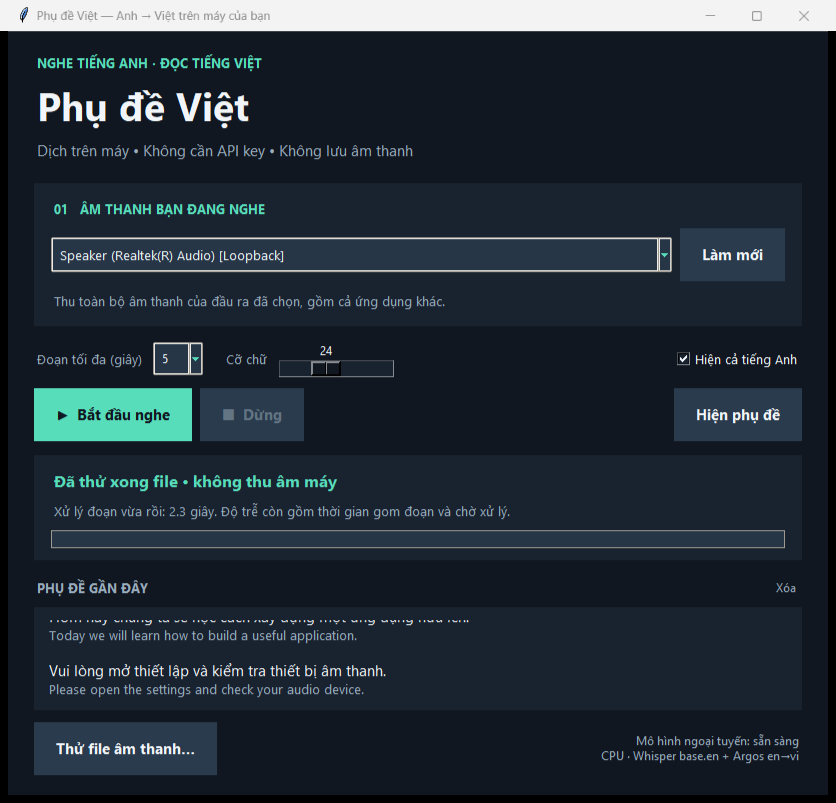
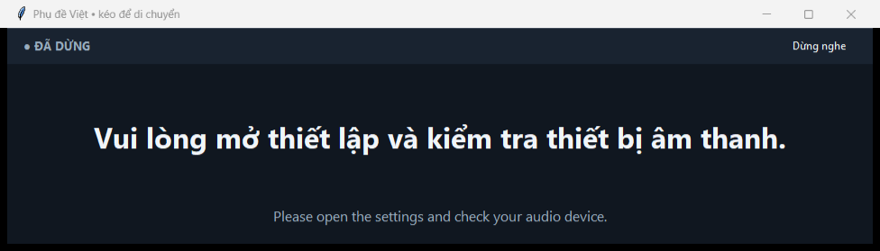

# Phụ đề Việt — nghe tiếng Anh, đọc tiếng Việt

Ứng dụng Windows cá nhân hiển thị phụ đề tiếng Việt trong cửa sổ luôn nổi. Nhận âm thanh đầu ra của loa/tai nghe qua WASAPI loopback, nhận dạng tiếng Anh bằng Whisper `base.en`, rồi dịch bằng mô hình Argos `en→vi`. Hai mô hình chạy trên CPU, ngoại tuyến sau khi cài xong. Không cần tài khoản, API key hay phí dịch theo phút.

## Cài từ GitHub trên Windows

Yêu cầu: **Windows 10/11 x64**, loa/tai nghe hoạt động, **Git** và **uv** có trên PATH. Không cần cài Python trước, không cần GPU NVIDIA. Bản này đã thử trên CPU i5-1235U với 16 GB RAM. Lần cài đầu cần Internet và dung lượng cho runtime, thư viện, cache và mô hình; nên để trống ít nhất 2 GB.

Nếu chưa có uv, cài theo [hướng dẫn chính thức của uv](https://docs.astral.sh/uv/getting-started/installation/) rồi mở lại terminal. `Setup.cmd` không tự cài uv toàn cục. Kiểm tra `git --version` và `uv --version` trước khi tiếp tục (phiên bản uv đã thử: 0.11.2).

Trong PowerShell, chuyển vào thư mục làm việc bạn có quyền ghi, rồi chạy:

```powershell
git clone https://github.com/tunguyen2004/live-subtitles.git
Set-Location live-subtitles
.\Setup.cmd
.\Start.cmd
```

**Bản clone mới chưa có mô hình, Python hay thư viện.** Phải chạy `Setup.cmd` thành công trước khi mở app. Setup tải Python 3.12 vào thư mục `.task-python` bên cạnh repository, tạo `.venv` trong repository, cài các phiên bản đã khóa, rồi tải hai mô hình vào `models`. Cache uv nằm ở `.task-cache` bên cạnh repository, nên thư mục cha cũng cần quyền ghi. Không đưa bất kỳ runtime, cache hoặc mô hình lớn nào lên Git.

Các file `.cmd` gọi PowerShell với phạm vi thực thi cho tiến trình đó; không cần đổi ExecutionPolicy toàn máy. Nếu chạy trực tiếp script `.ps1` bị chính sách chặn, dùng `.cmd`. Nếu Setup báo thiếu uv, lỗi mạng hoặc tải mô hình thất bại, sửa lỗi theo thông báo rồi chạy lại `Setup.cmd`; chỉ mở app sau khi thấy `Ready. Models are local. Run Start.cmd.`

Riêng bản đã được cài sẵn tại `D:\trick\thu\live-subtitles` có thể mở `Start.cmd` ngay, không cần chạy Setup lại. Đừng chạy lệnh clone vào thư mục này khi nó đã tồn tại.

## Cách sử dụng

1. Mở **`Start.cmd`** trong thư mục ứng dụng.
2. Chọn đúng đầu ra mà ứng dụng đang phát, giống mục loa/tai nghe trong Zoom, Meet hoặc Windows. Ví dụ máy kiểm thử có **Speaker (Realtek(R) Audio) [Loopback]** và **Speakers (DeskIn(R) Virtual Audio Device) [Loopback]**; máy khác sẽ có tên khác.
3. Bấm **Bắt đầu nghe**, sau đó phát nội dung tiếng Anh trong Meet, Zoom, trình duyệt hoặc ứng dụng khác.
4. Kéo thanh tiêu đề cửa sổ phụ đề đến vị trí thuận tiện. Đổi cỡ chữ hoặc bật/tắt dòng tiếng Anh ở cửa sổ chính. Bấm **Hiện phụ đề** để mở lại nếu đã đóng cửa sổ nổi.
5. Bấm **Dừng**, **Dừng nghe** trên phụ đề, hoặc phím **Esc khi một cửa sổ ứng dụng đang có focus**. Đóng cửa sổ điều khiển cũng yêu cầu dừng rồi thoát.

Ứng dụng mở ở trạng thái **đã dừng**, không tự ghi âm. Khi dừng, callback ngừng nhận dữ liệu mới; nếu mô hình đang tính toán, ứng dụng đợi đoạn đó kết thúc và bỏ kết quả. Cửa sổ chính sẽ báo khi đã dừng hẳn. Đóng riêng cửa sổ phụ đề chỉ ẩn phụ đề, không dừng; cửa sổ điều khiển vẫn hiện trạng thái đang nghe.

**Thử an toàn:** bấm **Thử file âm thanh…** và chọn `test-results\english-sample.wav` trong repository. Đây là giọng đọc tổng hợp bằng Windows, không phải cuộc họp được ghi lại. File mẫu nhỏ này có sẵn trong Git. Chế độ này đọc file, không mở thiết bị thu âm. File đầu vào phải nằm trong cây thư mục cha của repository (với bản cài gốc là `D:\trick\thu`); hãy đặt file bạn muốn thử vào `test-results`.




Nếu không có phụ đề: kiểm tra nội dung tiếng Anh đang phát, xem thanh mức âm thanh có chuyển động không, rồi **Dừng → Làm mới → chọn đúng loa/tai nghe → Bắt đầu nghe**. Nếu thanh có tín hiệu nhưng chưa có chữ, chờ hết một đoạn và thời gian xử lý; đọc thông báo trạng thái trong cửa sổ chính. Dùng file mẫu để phân biệt lỗi mô hình với lỗi chọn đầu ra.

## Thiết lập lại

Mở **`Setup.cmd`** khi cần cài lại thư viện hoặc tải mô hình thiếu. Bước này cần mạng để tải Python, gói từ PyPI, Whisper từ Hugging Face và gói Argos. Riêng hai mô hình tải khoảng **215 MB**; tổng dung lượng còn gồm Python, thư viện và cache. Script dùng `uv` đã có trên máy, không tự cài công cụ toàn cục và không đăng ký Python vào PATH.

- Runtime: `..\.task-python` tính từ repository.
- Môi trường ứng dụng: `.venv` trong repository.
- Mô hình: `models` trong repository.
- Cache uv: `..\.task-cache\uv` tính từ repository.
- Cache mô hình và file tạm: `.cache` và `.temp` dưới thư mục ứng dụng.

`Environment.ps1` và `configure_paths.py` đặt các đường dẫn này trước khi chạy. Script gọi executable `uv`/PowerShell và thư viện hệ thống Windows hiện có; không cài đặt toàn cục. Cấu hình phụ thuộc được khóa trong `requirements-lock.txt`; phiên bản mô hình Whisper được khóa theo revision, gói Argos được kiểm tra SHA-256 khi tải mới. Chỉ tải ở bước Setup; phần nhận dạng và dịch không có API mạng.

## Giới hạn cần biết

- **Chưa kiểm chứng capture thật trong từng ứng dụng Meet/Zoom.** Đã xác nhận máy liệt kê được thiết bị WASAPI; đã kiểm thử nhận dạng/dịch thật từ file. Logic capture, stop và tràn hàng đợi đã được kiểm thử bằng thiết bị giả trong test, không thu âm máy khi kiểm thử.
- Thu **toàn bộ âm thanh của đầu ra đã chọn**, có thể gồm nhạc, thông báo hoặc ứng dụng khác; chưa tách âm thanh từng tiến trình. Không dùng microphone làm nguồn.
- Chọn cùng loa/tai nghe trong Zoom/Meet và ứng dụng này. Khi đổi tai nghe, rút thiết bị hoặc thay đầu ra: **Dừng → Làm mới → chọn lại → Bắt đầu**. Ứng dụng không tự chuyển thiết bị giữa phiên.
- WASAPI loopback không đảm bảo hoạt động với mọi driver, chế độ exclusive, âm thanh bảo vệ DRM hoặc cấu hình Bluetooth. Cửa sổ nổi có thể không hiện trên nội dung fullscreen exclusive; hãy dùng chế độ cửa sổ hoặc borderless.
- Dịch theo đoạn: chốt khi có khoảng lặng khoảng 0,6 giây hoặc khi đạt 3/5/7 giây. Có lọc khoảng lặng bằng Silero VAD. Ngưỡng âm lượng ban đầu có thể bỏ qua tiếng quá nhỏ; nhạc nền liên tục có thể làm đoạn dài hơn.
- **Không phải dịch tức thì.** File giọng đọc khoảng 10 giây trên i5-1235U/16 GB mất khoảng 11,5 giây gồm nạp mô hình và xử lý lần đo trong `offline-check.json`. Từng đoạn mất khoảng 1,9–4 giây xử lý. Khi nghe trực tiếp còn cộng thời gian gom đoạn và xếp hàng; kết quả phụ thuộc tải máy.
- Hàng đợi chỉ giữ hai đoạn chưa xử lý. Khi máy không theo kịp sẽ bỏ đoạn cũ và hiện thông báo. Đoạn bị cắt ở giới hạn thời gian có thể mất ngữ cảnh hoặc nhận sai từ sát ranh giới; không ghép lại câu hoàn chỉnh xuyên đoạn.
- Whisper nhỏ và mô hình dịch có thể sai tên riêng, thuật ngữ, giọng nói khó nghe hoặc câu có nhiều người nói. Đây là công cụ hỗ trợ đọc hiểu cá nhân.
- Không lưu âm thanh hay phụ đề phiên nghe ra file, không gửi chúng đến máy chủ. Lịch sử gần đây chỉ nằm trong RAM; bấm **Xóa** để xóa khỏi giao diện. Các file `test-results` chỉ là chứng cứ từ mẫu tổng hợp.

## Cấu trúc để học và sửa tiếp

| File | Vai trò |
| --- | --- |
| `app.py` | Giao diện Tkinter, phụ đề luôn nổi, trạng thái phiên, UI queue; chỉ cập nhật widget trên main thread. |
| `engine.py` | Liệt kê/capture WASAPI, đổi stereo sang mono 16 kHz, gom đoạn, nhận dạng và dịch cục bộ; hàng đợi có giới hạn. |
| `models.py` | Tải mô hình rõ ràng ở bước setup; không tự tải trong phiên nghe. |
| `Environment.ps1`, `configure_paths.py` | Giữ môi trường, cache và thư mục tạm trong cây được cho phép. |
| `Make-Sample.ps1` | Tạo file giọng đọc tiếng Anh bằng voice Windows đã cài, không phát âm thanh. |
| `check.py` | Kiểm tra mô hình thật bằng file mẫu khi cấm kết nối socket mạng. |
| `test_engine.py` | Kiểm thử âm thanh, giới hạn bộ đệm, hủy phiên, tránh nhận microphone. |
| `ui_check.py` | Kiểm thử file thật lên giao diện và lifecycle với nguồn giả; ảnh chỉ render các cửa sổ của chính app. |

Luồng dữ liệu: **loa/tai nghe → callback WASAPI → đoạn âm thanh RAM → Whisper tiếng Anh → CTranslate2 + SentencePiece với mô hình Argos → hàng đợi UI → phụ đề tiếng Việt**. Mô hình nạp một lần mỗi lần mở app và giữ trong RAM giữa các phiên.

Chạy kiểm tra từ PowerShell trong thư mục ứng dụng:

```powershell
. .\Environment.ps1
.\.venv\Scripts\python.exe -m unittest -v test_engine
.\.venv\Scripts\python.exe check.py test-results/english-sample.wav
.\.venv\Scripts\python.exe ui_check.py
```

Các lệnh trên không mở capture thật. `check.py` và `ui_check.py` cần mô hình từ Setup; unit tests chỉ cần thư viện. File mẫu đã có trong Git. Muốn tạo lại mẫu, chạy `powershell.exe -NoProfile -ExecutionPolicy Bypass -File .\Make-Sample.ps1`; thao tác này cần một voice tiếng Anh đã cài sẵn trong Windows, không cần cho việc dùng mẫu đi kèm. Đừng hiểu kết quả test nguồn giả là đã xác nhận tất cả driver âm thanh.

## Nguồn kỹ thuật

- [PyAudioWPatch — WASAPI loopback trên Windows](https://github.com/s0d3s/PyAudioWPatch).
- [faster-whisper — CPU int8 và Silero VAD](https://github.com/SYSTRAN/faster-whisper).
- [Mô hình Whisper base.en](https://huggingface.co/Systran/faster-whisper-base.en).
- [Argos Translate](https://github.com/argosopentech/argos-translate) và [chỉ mục gói ngôn ngữ chính thức](https://github.com/argosopentech/argospm-index).

Phần dịch chạy trực tiếp mô hình CTranslate2/SentencePiece trong gói Argos, với chia câu đơn giản cho đoạn ngắn; không cài toàn bộ Argos/Stanza/PyTorch. Xem README đi kèm mô hình trong thư mục `models/translate-en_vi-1_9` để biết thông tin mô hình.
